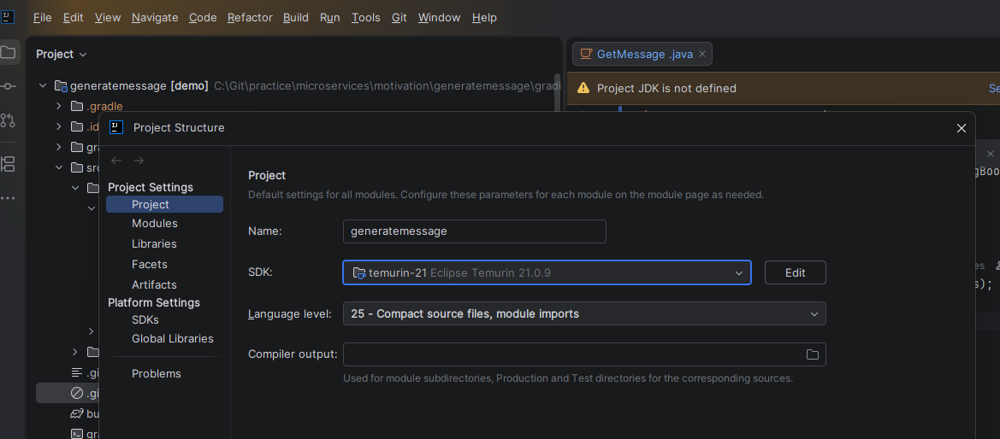

# Generate message
- Create spring boot app with [spring initialiser](https://start.spring.io/)
## Java sdk
- Go to `File → Project Structure` (or `Ctrl+Alt+Shift+S`)
- Project Settings → Project
- Set: 
  - `SDK`: Select Java 21
- `build.gradle` ~ `pom.xml` 


## Build
```bash
gradle clean build
```
- Compile: `gradle clean compileJava`
## Run
```bash
gradle bootRun
```
## 
- Open browser:
  - `http://localhost:9080/message/generate`
