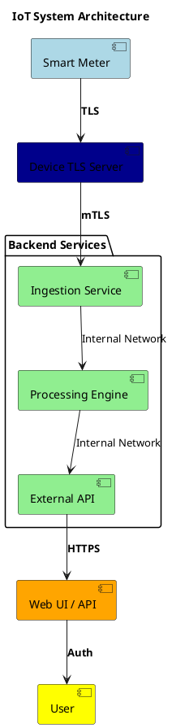
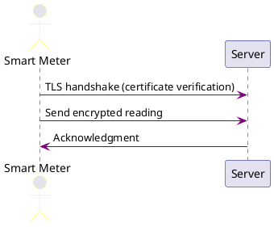
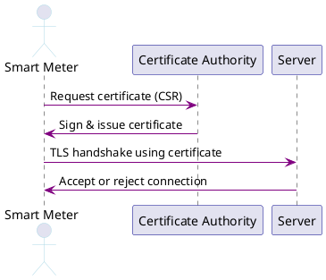
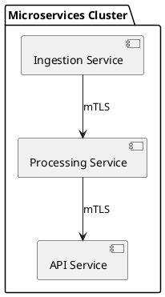
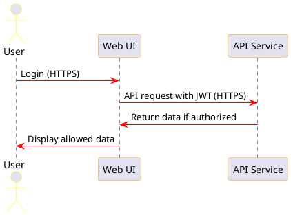
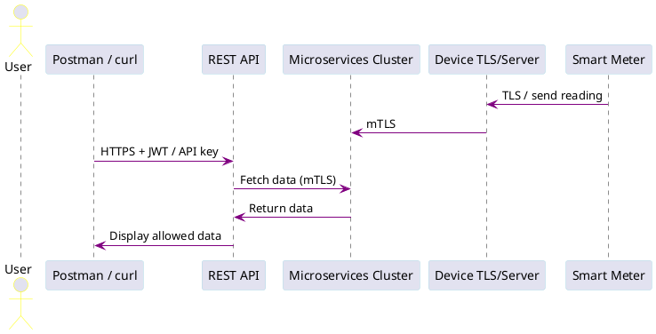
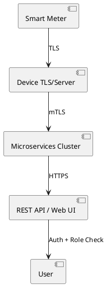

# Keys & Certificates in IoT Security (45 min)**
### **Slide 1 — Title Slide**
**Title:** Keys and Certificates in IoT and Smart Meter Security
**Subtitle:** End-to-End Security: Device, Services, and User Interface
**Content:**
* Your Name / Course / Date
  **Talking Points:**
* Welcome students
* Goal: understand **how cryptography enables trust from sensors → server → services → UI**
* Mention: lecture includes **practical demos**
  **Visual cue:** IoT devices + cloud + dashboard illustration
  **UML:** N/A (intro slide)
### **Slide 2 — Problem Hook: Why Security Matters**
**Content:**
* Threats in IoT/smart meters:
  * Fake readings
  * Command hijacking
  * Data leaks
* Questions:
  * How do we know a meter is genuine?
  * How do we ensure data integrity?
    **Analogy:** “Receiving a letter from someone claiming to be your bank — how do you know it’s real?”
### **Slide 3 — Overview: Security Chain**
**Content / Bullet Points:**
* End-to-end flow: Device → Server → Microservices → UI → User
* Security measures at each layer: keys, certificates, TLS/mTLS, HTTPS, authentication, authorization
  **UML / Container Diagram:**

### **Slide 4 — Cryptography Basics**
**Bullet Points:**

* Symmetric keys: same key encrypts & decrypts
* Asymmetric keys: public/private pairs
* Digital signatures for integrity
* Hashing ensures message integrity
  **Analogy:** Mailbox key (symmetric) vs signed letter (asymmetric + signature)
### **Slide 5 — Certificates & PKI Basics**
**Bullet Points:**
* X.509 certificates: Subject, Issuer, Public Key, Validity
* Certificate Authorities (CAs)
* Trust chain: device → CA → server
  **Analogy:** Certificates = passports issued by a government authority
### **Slide 6 — Device-to-Server Communication (TLS)**
**Bullet Points:**
* Devices send readings over **TLS**
* Certificates ensure **device identity**
* Prevents MITM attacks and data tampering
  **Demo cue:** Terminal example: `openssl s_client -connect server:443`
  **Analogy:** Smart meter carries a “passport” — server verifies it
  **UML / Diagram:**


### **Slide 7 — Demo: Device Certificates**
**Bullet Points / Steps:**
1. Generate key pair: `openssl genrsa -out device.key 2048`
2. Create CSR: `openssl req -new -key device.key -out device.csr`
3. Sign with CA: `openssl x509 -req -in device.csr -CA ca.crt -CAkey ca.key -out device.crt`
4. Verify certificate: `openssl verify -CAfile ca.crt device.crt`
   **Talking Point:** Shows how a smart meter proves identity
   **UML / Diagram:**


### **Slide 8 — Service-to-Service Security (mTLS)**
**Bullet Points:**
* Microservices communicate securely using **mTLS**
* Certificates verify identity of both client & server
* Encrypted communication prevents eavesdropping
  **Analogy:** Each microservice has a “passport”
  **UML / Diagram:**

### **Slide 9 — Authentication & Authorization on UI**
**Bullet Points:**
* Users log in via **HTTPS-protected web dashboard**
* Backend checks identity (OAuth/SSO/JWT)
* Role-based access ensures users only see allowed meters
  **Demo cue:** Screenshot of dashboard showing restricted access
  **UML / Diagram:**


### **Slide 10 — API Security Beyond TLS**
**Bullet Points:**
* REST API calls to fetch or send device data
* Use **HTTPS + JWT / API keys**
* Role-based access control ensures only authorized access
  **UML / Diagram:** Same as Slide 9 (sequence shows API security)
### **Slide 11 — Demo Tie-in to UI / REST**
**Bullet Points / Steps:**
1. Fetch device data over HTTPS with JWT:

   ```
   curl -H "Authorization: Bearer <JWT_TOKEN>" https://server/api/device/123/data
   ```
2. Show only allowed data is returned
   **Talking Point:** Demonstrates **end-to-end flow**: device → service → UI/API → authorized user
   **UML / Diagram:**


### **Slide 12 — Real-World Applications & Pitfalls**
**Bullet Points:**
* IoT firmware updates
* TLS/mTLS for ingestion and service communication
* JWT for UI/API sessions
* Common mistakes: expired certs, weak keys, over-permissive access
  **Talking Point:** Layered security: channel + identity + access control
  **UML / Diagram:** Optional small end-to-end container (same style as Slide 3)
### **Slide 13 — Interactive Recap / Quiz**
**Questions:**
* Why TLS/mTLS is essential even with device keys?
* Why HTTPS + JWT for UI/API calls?
* What happens if a CA is compromised?
  **Visual cue:** Could reuse Slide 3 diagram for reference
  **UML / Diagram:** Optional — use same as Slide 3
### **Slide 14 — Closing Takeaways**
**Bullet Points:**
* Devices: keys + certificates → trust & encryption
* Services: mTLS → secure service-to-service communication
* Users: HTTPS + JWT/auth → secure access
* Combined: end-to-end trust in IoT + microservices + UI systems
  **UML / Diagram (End-to-End Flow):**



✅ This merged plan now gives you **content + diagrams for each slide**, along with **demo cues and analogies**, ready to create your slide deck in **PowerPoint, Google Slides, or Canva**.


If you want, I can **also prepare a version with suggested colors, arrow labels, and diagram styling**, so when you export UML to PNG/SVG, the slides look **professional and consistent**.

Do you want me to do that next?
