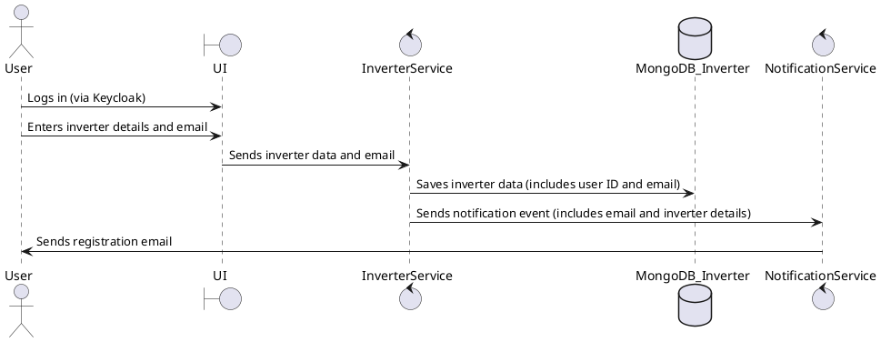
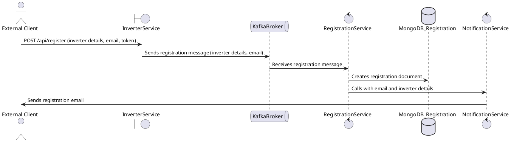

## Architecture

```plantuml
@startuml
actor User
boundary UI
control InverterService
database MongoDB_Inverter
control NotificationService

User -> UI : Logs in (via Keycloak)
User -> UI : Enters inverter details and email
UI -> InverterService : Sends inverter data and email
InverterService -> MongoDB_Inverter : Saves inverter data (includes user ID and email)
InverterService -> NotificationService : Sends notification event (includes email and inverter details)
NotificationService -> User : Sends registration email

@enduml
```

```plantuml
@startuml
actor "External Client" as Client
boundary InverterService
queue KafkaBroker
control RegistrationService
database MongoDB_Registration
control NotificationService

Client -> InverterService : POST /api/register (inverter details, email, token)
InverterService -> KafkaBroker : Sends registration message (inverter details, email)
KafkaBroker -> RegistrationService : Receives registration message
RegistrationService -> MongoDB_Registration : Creates registration document
RegistrationService -> NotificationService : Calls with email and inverter details
NotificationService -> Client : Sends registration email

@enduml
```
