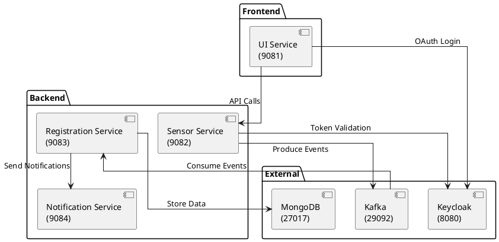
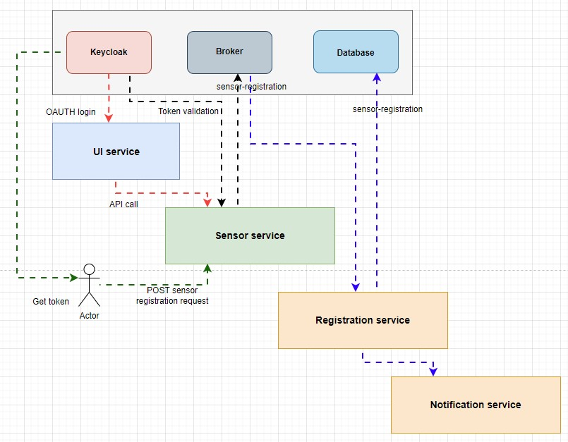

## Architecture

```plantuml
@startuml
skinparam style strict
skinparam linetype ortho

package "Frontend" {
  [UI Service\n(9081)] as UI
}

package "Backend" {
  [Sensor Service\n(9082)] as SENSOR
  [Registration Service\n(9083)] as REG
  [Notification Service\n(9084)] as NOTIF
}

package "External" {
  [Keycloak\n(8080)] as KEYCLOAK
  [MongoDB\n(27017)] as MONGO
  [Kafka\n(29092)] as KAFKA
}

UI --> SENSOR : API Calls
UI --> KEYCLOAK : OAuth Login
SENSOR --> KEYCLOAK : Token Validation
SENSOR --> KAFKA : Produce Events
KAFKA --> REG : Consume Events
REG --> MONGO : Store Data
REG --> NOTIF : Send Notifications
@enduml
```
