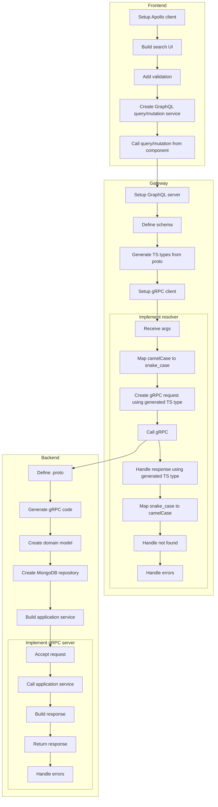

## Components
- [Frontend](frontend/README.md)
- [Gateway](gateway/README.md)
- [Backend](backend/README.md)
## Use cases
- [Register sensor](docs/register-sensor/README.md)
- [Search sensor](docs/search-sensor/README.md)
- [Update postcode](docs/update-postcode/README.md)
- [GraphQL playground](https://github.com/sbhrwl/microservices/blob/main/sensorregistration/graphql/gateway/README.md#graphql-playground)
## Quick view
### Backend
* [ ] Define `.proto`
* [ ] Generate grpc code
* [ ] Create domain model
* [ ] Create mongodb repository
* [ ] Build application service
* [ ] Implement grpc server
  * Accept request
  * Call application service
  * Build response
  * Return response
  * Handle errors
### Gateway
* [ ] Setup graphql server
* [ ] Define schema
* [ ] Generate ts types from proto
* [ ] Setup grpc client
* [ ] Implement resolver
  * Receive args
  * Map args from camelCase → snake_case
  * Create grpc `request` using generated ts type
  * Call grpc
  * Handle response using generated ts type
  * Map `response` from snake_case → camelCase
  * Handle errors
### Frontend
* [ ] Setup apollo client
* [ ] Generate TypeScript types from GraphQL schema
  * [ ] Use GraphQL Code Generator (or equivalent)
  * [ ] Input
    * [ ] GraphQL schema
    * [ ] Queries and mutations
  * [ ] Output
    * [ ] Query result types
    * [ ] Mutation result types
    * [ ] Variable types
* [ ] Build UI (search / register / update)
* [ ] Add validation
* [ ] Create GraphQL query or mutation service
  * [ ] Use generated TypeScript types in `apollo.query()` / `apollo.mutate()`
* [ ] Call query or mutation from component

  
mermaid

