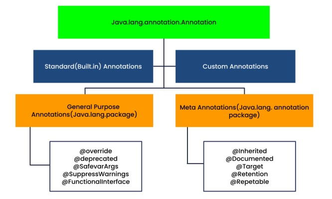

# API
- [Data and Time API](lectures/1.DateTime.pdf)
  - [Date Time demo](exercises/DateTimeDemo.java), [Options with Time](exercises/TimeOptionsDemo.java)
- [`ForEach()` method](exercises/ForEachDemo.java)
- [Stream API](lectures/2.StreamAPI.pdf)
  - [exercise](exercises/StreamDemo.java)
- [Enum](lectures/3.Enum.pdf)
  - [Enum](exercises/EnumDemo.java) and [Switch case](exercises/EnumWithSwitchDemo.java)
- [Annotations](lectures/4.Annotation.pdf)
  - [Custom annotation](exercises/CustomAnnotationDemo.java)
  - [Reflection API](lectures/5.Reflection.pdf)
    - [exercise](exercises/ReflectionDemo.java)

- [Questions](lectures/6.AssignmentQuestions.pdf)
