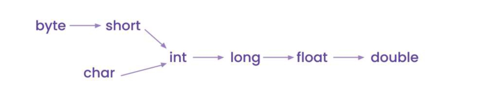

## [Introduction to Java](lectures/4.JavaFundamentals.pdf)
- Introduction to Programming
- Basic feature of Java
  - Platform independency
    - Platform = OS + Processor (Windows + Intel)
    - Java program (`.java` file) -> Compiler -> **Bytecode** (`.class` file) -> JVM converts it to MLL and executes
    - Same bytecode can be also be executed on other platforms (JVM knows how to do it) (32.7:00)
    - So Write Once and Run Anywhere (WORA)
- Main method
```
public static void main(String args[])
public static void main(String []args)
static public void main(String args[])
static public void main(String ... args)
```
- Classes and Objects (Basics)
## [Variables and data types](lectures/5.VariablesAndDatatypes.pdf)
- Statically typed vs Dynamically types programming languages
- Naming Convention
- Identifiers


## [Operators](lectures/6.Operators.pdf)
- Operators in Java
- Incrementation and Decrementation
## [Conditional statement](lectures/7.ConditionalStatements.pdf)
- If - else / Ternary
- Switch case
## [User input in Java](lectures/9.UserInput.pdf)
- [Scanner class](exercises/ScannerDemo.java)
## [Loops](lectures/8.Loops.pdf)
- for - while - do while
```
How to choose between while loop and for loop?
Generally a while loop is used whenever the total number of iterations to be made is unknown. 
- Use a for loop when you are traversing a data structure like an arrays
- Use a for loop when you know that loop needs to run ‘n’ number of times.
Whereas
- Use a while loop when increment type is nonstandard like i = i * 2d
- Use a while loop when you are unsure till when the loop will continue, like while finding the first number divisible by 13
```
- More on loops
## [Pattern programs](lectures/10.PatternProgramming.pdf)
- Nested loops
- If else and nest loops to write complex patterns
- [Pattern1](exercises/Pattern1.java), [Pattern2](exercises/Pattern2.java), [Pattern3](exercises/Pattern3.java) and [ComplexPattern](exercises/ComplexPattern.java)

## [Computer basics](lectures/1.ComputerBasics.pdf)
- What is a Computer ?
- Classification of Computer (Based on Size, Work and Purpose)
- Components of Computer(Basic)
- Important Components of Computer(Primary Memory, Processor, Secondary Memory)
## [Version control system](lectures/2.VersionControlSystem.pdf)
- Git foundation
- Setting, maintaining and tracking git repos
- Git snapshots (commit is a snapshot in time)
- [Git commands](lectures/3.GitCommands.pdf)
- Git branches
- Git merging
- [Git practice](https://github.com/sbhrwl/system_design/blob/main/docs/Other/git/Practice.md)
