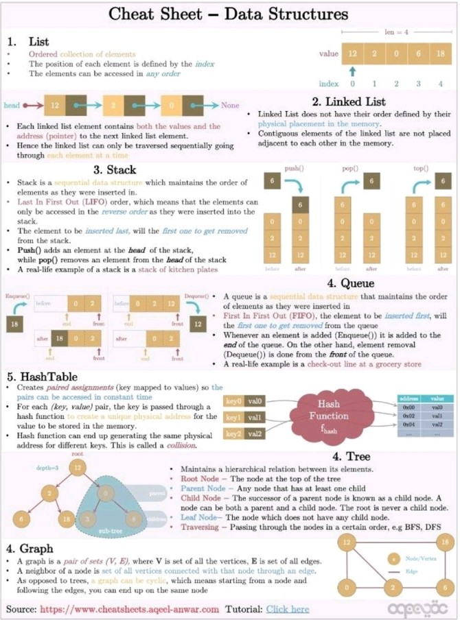

# Data structure
- Question- I have data, i have a hard disk. How do i store this data in the hard disk?
  - Options- List/Tree/Queue/Stack/Map
- List, set, map, queue, and stack are data structures used in computer science for organizing and storing data. They can be classified as follows:

## List
- A list is an ordered collection of elements where each element is identified by its position or index. 
- Lists are typically used for storing and manipulating data that needs to be accessed and modified frequently.

## Set
- A set is an unordered collection of unique elements. 
- Sets are useful for quickly checking whether an element is present in a collection or not.

## Tree
- A tree is a hierarchical data structure consisting of nodes connected by edges. 
- Each node has a parent node (except for the root node) and zero or more child nodes. 
- Trees are often used to represent hierarchical relationships, such as the file system on a computer or the structure of a web page.

## Queue
- A queue is a collection of elements that supports adding elements to the back (enqueue) and removing elements from the front (dequeue). 
- This follows the "first in, first out" (FIFO) principle. 
- Queues are often used in algorithms that require processing elements in a specific order, such as breadth-first search.

## Stack
- A stack is a collection of elements that supports adding elements to the top (push) and removing elements from the top (pop). 
- Stacks are often used in algorithms that require processing elements in a last-in, first-out (LIFO) order, such as depth-first search or expression evaluation.

## Map
- A map (also known as a dictionary) is a collection of key-value pairs where each key is associated with a value. 
- Maps are commonly used for storing and retrieving data using a unique identifier.

## Summary
In summary, the list, set, map, queue, and stack are all data structures used in computer science that can be classified according to their
- order, 
- uniqueness of elements, 
- key-value association, and 
- order of processing

- List, Queue and Stack are ordered and mutable data structures.
- Set and Map are unordered and mutable data structures.
- Tree is an ordered and immutable data structure.
