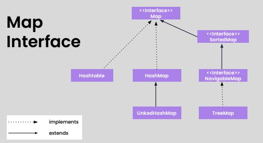

# [Collection framework](DataStructure.md)
- [Collection hierarchy](#collection-hierarchy)
- [Available interfaces](#available-interfaces)
- [Enumerators](#enumerators)
  - [Fail fast Vs fail safe](#fail-fast-vs-fail-safe)
  - [Collection questions](lectures/4.CollectionAssignment.pdf)
- [Map](#map)
- [Generics](#generics)
  - [Map and Generics questions](lectures/9.Map-GenericsAssignment.pdf)
- [Collection class](#collection-class)

## [Collection hierarchy](lectures/1.CollectionHierarchy.pdf)


### 9 key **`interfaces`** of Collection framework
- Collection
- List 
  - List interface is the child interface of Collection interface. 
  - It inhibits a list type data structure in which we can store the **ordered collection of objects** 
  - It can have **duplicate** values
  - It is represented using square brackets []
  - List interface is implemented by the classes ArrayList, LinkedList, Vector, and Stack.
- Set 
  - Doesn't allows to store duplicate values
  - uses curly brackets {}
- SortedSet
- NavigableSet
- Queue
- Map
  - key-value 
- SortedMap
- NavigableMap

## [Available interfaces](lectures/2.CollectionInterfaces.pdf)
- [ArrayList](exercises/ArrayListDemo.java)
  - The ArrayList class implements the `List` interface.
  - It uses a dynamic array to store the duplicate element of different data types.
  - The ArrayList class maintains the insertion order and is non-synchronized.
  - The elements stored in the ArrayList class can be randomly accessed.
- [LinkedList](exercises/LinkedListDemo.java)
  - LinkedList implements the `List` and `Deque` interface.
  - It uses a **doubly linked list** internally to store the elements.
  - It can store the duplicate elements.
  - It maintains the insertion order and is not synchronized.
  - In LinkedList, the manipulation is fast because no shifting is required.


- [ArrayDeque](exercises/ArrayDequeDemo.java)
  - ArrayDeque class implements the `Deque` interface.
  - It facilitates us to use the Deque. Unlike queue, we can add or delete the elements from both the ends.
  - ArrayDeque is **faster than ArrayList and Stack** and has no capacity restrictions.
- [PriorityQueue](exercises/PriorityQueueDemo.java)
  - The PriorityQueue class implements the Queue interface.
  - It holds the elements or objects which are to be processed by their priorities.
  - PriorityQueue **doesn't allow null values** to be stored in the queue.


- [TreeSet](exercises/TreeSetDemo.java)
  - TreeSet class implements the Set interface that uses a tree for storage.
  - TreeSet also contains unique elements.
  - However, the access and retrieval time of TreeSet is quite fast.
  - The elements in TreeSet **stored in ascending order**.


- [HashSet](exercises/HashSetDemo.java)
  - HashSet class is used to create a collection that uses a hash table for storage. 
  - It inherits the AbstractSet class and implements Set interface.
  - The important points about HashSet class are:
    - HashSet stores the elements by using a mechanism called hashing.
    - HashSet contains unique elements only.
    - HashSet allows null value.
    - HashSet class is non synchronized.
    - The initial default capacity of HashSet is 16, and the load factor is 0.75.


- [LinkedHashSet](exercises/LinkedHashSet.java)
  - LinkedHashSet class is a Hashtable and Linked list implementation of the Set interface. 
  - It inherits the HashSet class and implements the Set interface.
  - The important points about the LinkedHashSet class are:
    - LinkedHashSet class contains unique elements only like HashSet.
    - LinkedHashSet provides all optional set operations and permits null elements.
    - LinkedHashSet is non-synchronized.
    - LinkedHashSet maintains insertion order.

## [Enumerators](lectures/3.Enumerators.pdf)
- [Iterator, List Iterator](exercises/IteratorDemo.java)
  - An Iterator is an interface and we can traverse the elements of a list in a forward direction whereas a 
  - ListIterator is an interface that extends the Iterator interface and we can traverse the elements in both forward and backward directions.
  - An Iterator can be used in these collection types like List, Set, and Queue whereas 
  - ListIterator can be used in List collection only.
  - The important methods of Iterator interface are hasNext(), next() and remove() whereas important methods of 
  - ListIterator interface are add(), hasNext(), hasPrevious() and remove().
- Enumeration Interface
  - The Enumeration interface is the only legacy interface. 
  - Enumeration, which is a legacy interface that was used to traverse collections before the introduction of the Iterator interface.
  - It defines methods, which help us to enumerate the elements in a collection of objects. 
  - It contains only 2 methods as shown here:
    - boolean hasMoreElements(): 
      - Checks if the enumeration contains more elements. 
      - If it contains more elements, then it returns true, else it returns false.
    - Object nextElement(): 
      - Returns the next element of the enumeration. 
      - If there are no more elements to retrieve then it throws NoSuchElementException.
### [Fail fast Vs fail safe](exercises/FailFastVsFailSafeDemo.java)
- `CopyOnWriteArrayList`

## Map
- [Map hierarchy](lectures/5.Map.pdf)


- HashMap
  - [exercise](exercises/HashMapDemo.java), [Iterating HashMap demo](exercises/IteratingHashMapDemo.java), [Iterate over student object demo](exercises/IterateOverStudentObjectDemo.java)
- TreeMap
  -[exercise](exercises/TreeMapDemo.java)
- [Weak HashMap](exercises/WeakHashMapDemo.java)
- Supported methods
```
● clear()
● containsKey(Object)
● containsValue(Object)
● entrySet()
● equals(Object)
● get(Object)
● hashCode()
● isEmpty()
● keySet()
● put(Object, Object)
```
## [Generics](lectures/6.Generics.pdf)
- [Type safety](exercises/GenericsTypeSafetyDemo.java), [Type safety. student demo](exercises/GenericsTypeSafetyWithStudentDemo.java)
- [Generics classes](lectures/7.GenericsClasses.pdf)
  - [exercise](exercises/GenericClassDemo.java)
- [Comparable vs Comparator](lectures/8.ComparatorVsComparable.pdf)
- Supported methods
```
● sort(List<T> list)
● reverse(List<T> list)
● shuffle(List<?> list)
● binarySearch(List<? extends Comparable<? super T>> list, T key)
● max(Collection<? extends T> coll)
● frequency(Collection<?> c, Object o)
```

## Collection class
- [Sort example](exercises/CollectionClassDemo.java)
