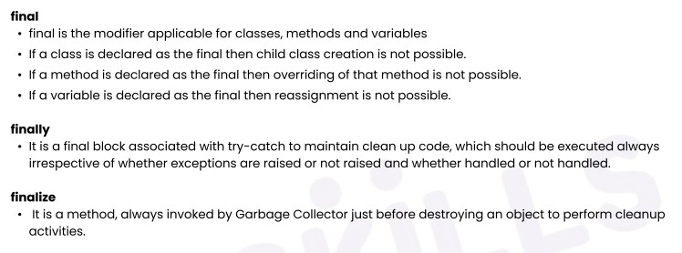
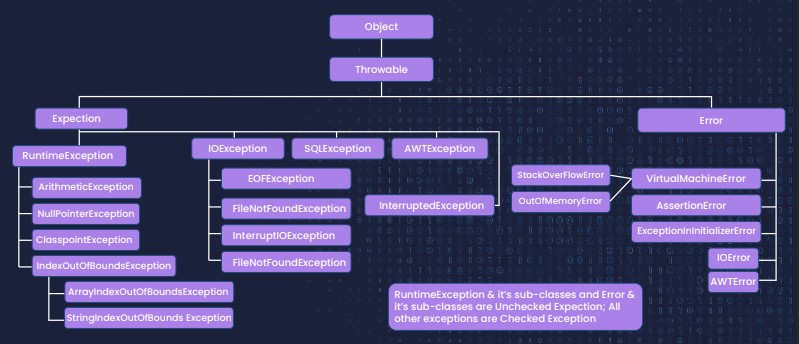

### [Exception Handling](lectures/1.ExceptionHandling.pdf)
- Different types of Errors in Java
- [What is an Exception?](lectures/2.ExceptionsHierarchy.pdf)
  - Hierarchy of an Exception class
- [try-catch: Need of Encapsulation]((lectures/3.TryCatch.pdf))
  - [Multiple catch block](exercises/TryCatchDemo.java)
  - [try finally](exercises/TryFinallyDemo.java)
  - [try with Resources](exercises/TryWithResourcesDemo.java)
- [Handling vs Ducking an Exception](lectures/4.HandlingVsDucking.pdf)
  - Rethrowing an Exception(`throw, throws,finally`)
- [Custom Exception](lectures/5.CustomizedExceptions.pdf)
  - [throw Exception class object](exercises/CustomExceptionThrowException.java)
  - [throw Custom exception  class object](exercises/CustomExceptionDemo.java)
- [Control flow of Exception Handling concept](lectures/6.ExceptionsControlFlow.pdf)
- [Java 1.7 version enhancements](lectures/7.ExceptionNewerEnhancements.pdf)
- [Questions](lectures/8.Questions.pdf)

## final Vs finally Vs finalize


## Exception hierarchy
- Checked Vs Uncheked exceptions


```
public class UncheckedException
{
	public static void main(String[] args)
	{
		int result = 7/0;
		System.out.println(result);
	}
}
// Output: Exception in thread "main" java.lang.ArithmeticException: / by zero 
//           at ExceptionTest.main(ExceptionTest.java:7)
```
### Runtime error or Exception
```
public class RuntimeErrorOrException
	{
	public static void main(String[] args)
	{
		int num1=6;
		int num2=0;
		int result=num1/num2;
		System.out.println(result);
		System.out.println("Bye");
	}
}

// Output: Exception in thread "main" java.lang.ArithmeticException: / by zero
```
## Summary

