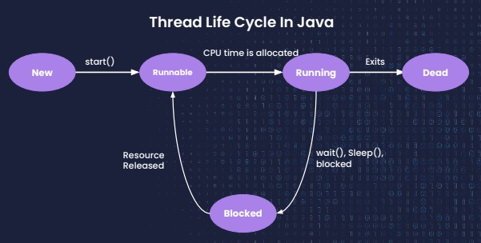
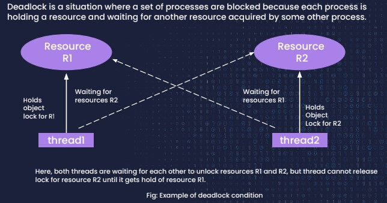

# Multithreading
- [Multitasking](lectures/1.Multitasking.pdf)
  - Tasking Vs Multitasking
  - Process based multitasking (multiple processes/application running on our computer)
  - Thread based multitasking (multiple thread with in same process/application)
- [Need of multiple threads](exercises/NeedForMultithreading.java)
  - [Main thread in java](exercises/CheckMainThreadProperties.java)
- [Thread scheduler](lectures/2.ThreadScheduler.pdf)
  - `run()` method
- Different states of a `Thread`

- [How to create threads](lectures/3.HowToCreateThreads.pdf)
  1. [extend Thread class](exercises/CreateOwnThread.java)
     - [Multi tasking with extend Thread class](exercises/MultiThreadExample.java)
  2. [implement Runnable interface](exercises/MultiThreadWithRunnable.java)
  3. [Multiple tasks within a single `run()`](exercises/MultiThreadWithRunnable.java)
- [Methods](lectures/4.ThreadMethods.pdf)
  - [`join()`](exercises/JoinIsAliveDemo.java)
  - `isAlive()`
  - [`interrupt()`](exercises/InterruptDemo.java)
- [`syncronised` keyword](lectures/5.Synchronised.pdf)
  - [Synchronized car parking](exercises/SynchronizedCarParkingDemo.java)
  - [Synchronized student borrowing books from library](exercises/SynchronizedStudentDemo.java)
- [Deadlock](lectures/6.Deadlock.pdf)
  - [Yield](exercises/YieldDemo.java)

- [Producer-Consumer problem](lectures/7.InterThreadCommunication.pdf)
  - [exercise](exercises/ProducerConsumerDemo.java)
- [Questions](lectures/8.MultithreadingQuestions.pdf)
