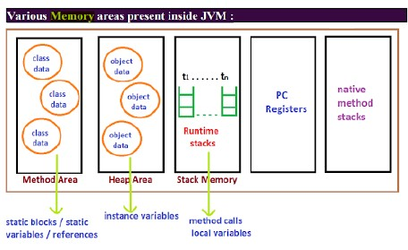
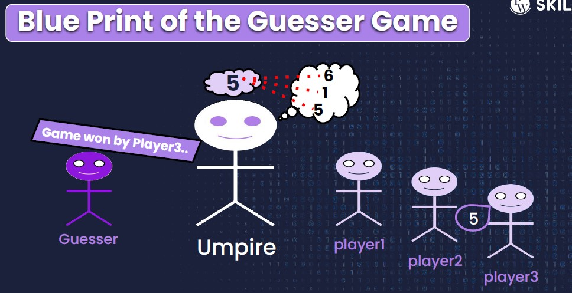
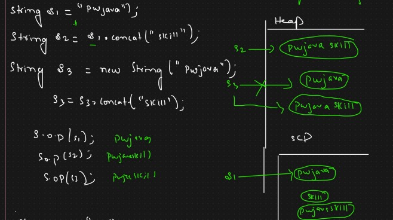
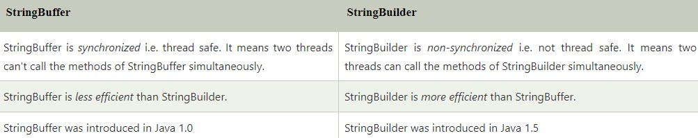
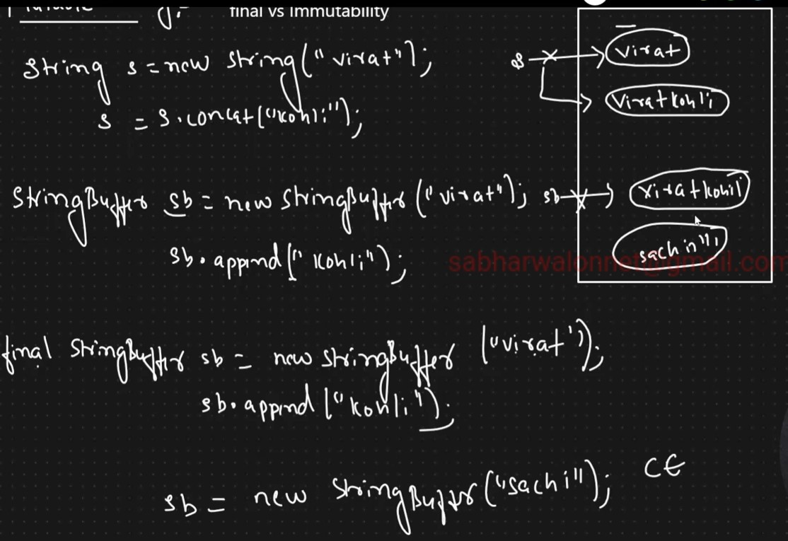

### Oops fundamentals
- [Object creation](lectures/1.ObjectCreation.pdf), [exercise](exercises/ObjectCreation.java)
- [Instance variable vs local variables](lectures/2.Instance-Localvariables.pdf)
- Methods with memory maps (JVM data areas)
 
  
  - Class level binary data including static variables will be stored in `method area`
  - Objects and corresponding instance variables will be stored in the `Heap area`. 
    - For every method the JVM will create a `Runtime stack`, 
    - All method calls performed by that Thread and corresponding local variables will be stored in that stack. 
    - Every entry in stack is called Stack Frame or Action Record
  - The instruction which has to execute next will be stored in the corresponding `PC Registers`.
  - Native method invocations will be stored in `native method stacks`. 
- [Method overloading](lectures/3.MethodOverloading-AutomaticePromotion.pdf), [exercise](exercises/MethodOverloading.java)
- [Automatic type promotion](lectures/3.MethodOverloading-AutomaticePromotion.pdf), [exercise](exercises/ObjectCreation.java)
### [Guessor game](exercises/LaunchGame.java)


### [Array](lectures/4.ArraysBasics.pdf)
- Why an array?
- What is an Array?
- How to create an array?
- Different ways to create an Array
  - [1d](exercises/OneD.java), [2d](exercises/TwoD.java), 3d and [jagged array](exercises/JaggedArray.java)
- [Enhanced `For loop`](exercises/EnhancedForLoop.java)
- [Length Vs Length()](lectures/5.ArraysBasic-continues.pdf), [exercise](exercises/LengthPropertyAndMethod.java)
- Anonymous arrays, [exercise](exercises/AnonymousArray.java)
- Buffer over run and arrayindexoutofbounds exception, [exercise](exercises/ArrayIndexOutOfBoundsExceptionExample.java)
- Disadvantages of Array in Java
### [Strings](lectures/6.Strings_SCP_Mutability.pdf)
- String Introduction `java.lang.String` (no need to import, `lang` packages are available by default)
- Types of String
- Memory Map(**String Constant Pool**)
  - Each copy of a string from Heap is available also in SCP
- Immutable String (`String` class) 
- [Ways to compare](lectures/7.String_Comparisons_Methods_Concatenation.pdf)
- Inbuilt methods in String class
- Concatenation


- [Revering String Different cases](exercises/Reverse.java)
- [Palindrome- Same word when written in reverse order](exercises/Palindrome.java)
- [Anagram program- Two words or sentences conatining same alphabets](exercises/Anagram.java)
- [Pangram program- Pangram contains all alphabets (A-Z)](exercises/Pangram.java)
- [Mutable string: `String Buffer and String Builder` offers mutable string](lectures/8.Mutable_strings.pdf), [exercise](exercises/Mutable.java)


```
public class BufferTest{  
    public static void main(String[] args){  
        StringBuffer buffer=new StringBuffer("hello");  
        buffer.append("java");  
        System.out.println(buffer);  
    }  
} // hellojava

public class BuilderTest{  
    public static void main(String[] args){  
        StringBuilder builder=new StringBuilder("hello");  
        builder.append("java");  
        System.out.println(builder);  
    }  
}  // hellojava
```
- `Final` Vs Mutable string
  - String initialised as `final`
    - Content can be changed but it can not be referenced to another string


- Method chaining
```
StringBuffer sb = new StringBuffer();
sb.append("sachin").insert(6, "tendulkar").reverse().append("IND").delete(0,4).reverse();
System.out.println(sb);
```
### [Static](lectures/9.Static.pdf)
- Static keyword, [exercise](exercises/DemoStatic.java)
- [Class loading and How java program actually executes](lectures/10.Java_program_execution.pdf)
- [Different components in Java program](lectures/11.Java_program_structure.pdf)
- Static variables, static methods, static block
- Differences w.r.t Non static and static members of a class
