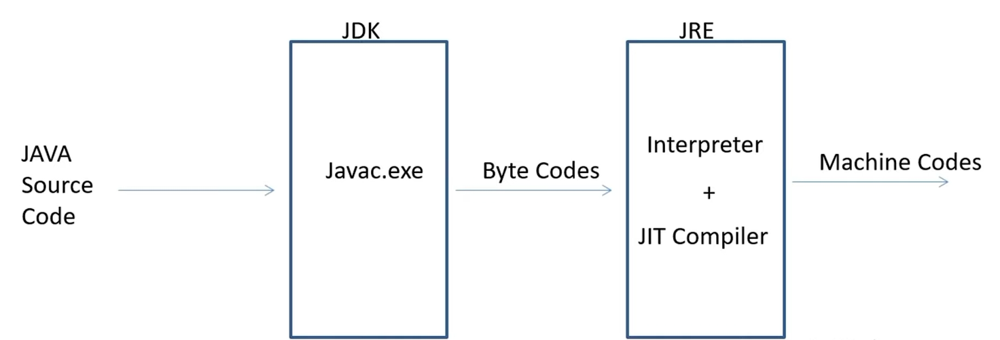

# [Questions](https://github.com/sbhrwl/system_design/blob/main/docs/Other/sirius/Questions.md)
- [Basics](#basics)
- [Oops](https://github.com/sbhrwl/system_design/blob/main/docs/Middleware/java/oops-2/lectures/11.OOPS-assignment.pdf)
- [Collection](https://github.com/sbhrwl/system_design/blob/main/docs/Middleware/java/collection_framework/lectures/4.CollectionAssignment.pdf)
- [Map and Generics](https://github.com/sbhrwl/system_design/blob/main/docs/Middleware/java/collection_framework/lectures/9.Map-GenericsAssignment.pdf)
- [Exception handling](https://github.com/sbhrwl/system_design/blob/main/docs/Middleware/java/exception_handling/lectures/8.Questions.pdf)
- [Multi threading]()
- [APIs in java](https://github.com/sbhrwl/system_design/blob/main/docs/Middleware/java/api/lectures/6.AssignmentQuestions.pdf)
- [File handling]()
- [MVC](https://github.com/sbhrwl/system_design/blob/main/docs/Middleware/go/crud/README.md#mvc-architecture)
- [Firefly](https://www.fireflysource.com/)
- [Open Services Gateway Initiative standard](https://en.wikipedia.org/wiki/OSGi) 
  - OSGi is built around a service-oriented architecture. 
  - Applications or components, come in the form of **bundles (JARs)** for deployment, can be **remotely installed, started, stopped, updated, and uninstalled without requiring a reboot**. 
  - [Good read on OSGi](https://www.infoworld.com/article/3543072/what-is-osgi-java-modularity-with-the-open-service-gateway-initiative.html)

# Basics
## What is meant by the term "platform independent" and how is it related to Java? 
- The term `platform independent` means that a programming language is NOT dependent on any one platform to run. 
- In other words, once the code has been compiled, it can then be executed on any platform or operating system. 
- One of the great things about Java is that it is platform-independent. 
- It achieves this because the `Java compiler is able to convert code to bytecode`, this **bytecode** can then run on any operating system or platform `using Java Virtual Machine (JVM)`

## What is meant by the term "Wrapper Classes"? 
- Wrapper classes are used in Java to create objects. Essentially, they tell Java primitives to change into reference types — objects. 
- The reason it gets the name `Wrapper Classes` is because they **wrap** around the primitive data to form an object in the class of the primitive data that has been associated to it

### Why Java is not 100% Object-oriented? 
- Because of Primitive data types namely: `boolean, byte, char, int, float, double, long, short`
- To make them `Object-oriented` we have **wrapper classes** which actually "wrap" the primitive data type into an object of that class. 

## What is Multithreading in Java? 
- `Multithreading` is a procedure of executing two or more threads simultaneously to perform a certain operation via utilizing the CPU resources to the maximum. 
- Multiple threads **do not need separate memory allocation**, hence they save memory and also **run in parallel to each other** 

## Does Java include Pointers? 
- Java includes JVM (Java Virtual Machine). 
- **JVM** automatically take care of memory allocation. Hence, Java finds no use of Pointers in real-time programming 
- Java also has it's **own Garbage collector** to free the unused memory. 

### Why pointers are not used in Java? 
- They are unsafe. 
- Increases the complexity of the program and since Java is known for its simplicity of code, adding the concept of pointers will be contradicting. 
- Since **JVM** is responsible for implicit memory allocation, thus in order to avoid direct access to memory by the user, `pointers are discouraged in Java`

##  What are JDK, JVM, and JRE? 
- JDK : Java Development Kit (Software package of **JVM and JRE** together) 
- JVM : Java Virtual Machine (Converts program to Bytecode) 
- JRE : Java Runtime Environment (Provides the libraries and resources for **execution**) 
- JIT : Just In Time compiler


## What is the difference between Overloading and Overriding? 
- When two or more methods in the same class have the same name but **different parameters**, it's called `Overloading`. 
- When the **method signature** (name and parameters) are the **same in the superclass and the child class**, then it's called `Overriding`

## What is a Package in Java? 
- A package is a **namespace** that organizes a set of related classes and interfaces. 
- Conceptually you can think of packages as being similar to different folders on your computer. 

##  Which is the Base Class of all the Exceptions in Java? 
- The parent class or the Base class of all the exceptions in java is the `java. Lang`

## If I import a package, Will the JVM import all the sub-packages of the imported package? 
- **No**, When you import a specific package, then the sub-packages of the same will not be imported along with it. 
- However, the developer can manually import the sub-packages when finds necessary. 

## Does Java has GoTo Statement? 
- Java does not have the Goto statement, but it has something similar, called as `Labels`
- Labels are used to change the flow of the program and jump to a specific instruction or label `based on a condition`

## Is it possible to have a class compiled without main method? 
- **Yes**, we can execute a java program without a main method by **using a `static block`**. 
- Static block in Java is a group of statements that gets executed only once when the class is loaded into the memory by **Java ClassLoader**
- It is also known as a `static initialization block`

##  Can dead thread be restarted in Java Multithreading? 
- **No**, once a thread is terminated in Java, it cannot be restarted 

## Why String is immutable in java? 
- **String pool** requires string to be immutable otherwise `shared reference` can be changed from anywhere. 
- As string is shared on different area like file system, networking connection, database connection , **having immutable string** allows you to be secure and safe because no one can change reference of string once it gets created. 

## What is singleton class in Java and how can we make a class singleton? 
- Singleton class is a class whose only `one instance` can be created at any given time, `in one JVM` 
```
public class Animal {
    private static Animal singLe_instance = null; 
    private Animal() // Constructor as private
    public static Animal .getInstance() 
    {
        if (singLe_instance == null) 
            singLe_instance = new Animal(); 
        
        return singLe_instance;
    }
 }
```

## How Can You Make a Class Immutable? 
- Declare the class as **final** so it can't be extended.
- Make all fields **private** so that direct access is not allowed
- **Don't provide setter methods for variables**
- Make **all mutable fields final** so that it's value can be assigned only once
- Initialize all the fields via a constructor performing a `deep copy`
- Perform `cloning of objects in the getter methods to return a copy` rather than returning the actual object reference. 

## Does "finally" always execute in Java? 
- Not in following cases 
  - `System.exit()` function
  -  System crash 

## What Methods Does the `Object Class` Have? 
- `Java.lang.Object` class, parent of all has following methods 
  - protected Object `clone()` throws CloneNotSupportedException 
    - Creates and returns a copy of this object. 
  - public boolean `equals(Object obj)`
    - Indicates whether some other object is "equal to" this one. 
  - protected void `finalize()` throws Throwable
    - Called by the garbage collector on an object when garbagecollection determines that there are no more references to the object. 
  - public final Class `getClass()`
    - Returns the runtime class of an object. 
  - public int `hashCode()`
    - Returns a hash code value for the object.
  - public String `toString()`
    - Returns a string representation of the object. 
  - public final void notify()
  - public final void notifyAll()
  - public final void wait()
  - public final void wait(long timeout)
  - public final void wait(long timeout, int nanos) 

## Can you override a private or static method in Java? 
- You can not override a private or static method in Java.
- You cannot override a private method in sub class because it's not accessible there, 
  - What you do is create another private method with the same name in the child class . 
- For static methods if you create a similar method with same return type and same method arguments in child class then it will hide the superclass method, this is known as `method hiding`
