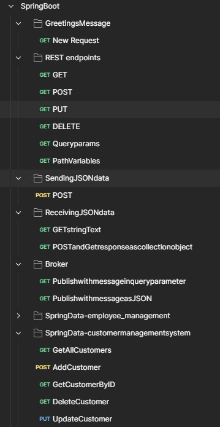

# Spring framework
- [Java basics](Java/README.md)
- [Introduction](#introduction)
- [Spring modules](#spring-modules)
- [Benefits](#benefits)
- [APIs](#apis)
## Introduction
- The **Spring framework** is a powerful, lightweight, and modular **open-source application framework** for building `enterprise-level` Java applications. 
- It provides comprehensive infrastructure support for developing Java applications, making it easier to handle tasks like
  - `Dependency injection`
  - `Transaction management`
  - `Web application development`
## Spring modules
- [**Dependency Injection (DI) & Inversion of Control (IoC)**](DependencyInjection/README.md)
  - Manages object creation and dependencies automatically.
  - Reduces tight coupling between components using `@Autowired` and `@Component`.
- [**Spring Boot**](SpringBoot/README.md)
  - Simplifies setup with auto-configuration and embedded servers (Tomcat, Jetty).
  - Provides starter dependencies (`spring-boot-starter-web`, `spring-boot-starter-data-jpa`).
- [**Spring Data**](SpringData/README.md) 
  - Simplifies database access (JPA, DTO).
  - Reduces boilerplate code with repositories (`CrudRepository`, `JpaRepository`).
- [**Spring MVC (Model-View-Controller)**](SpringMVC/README.md)
  - A web framework for building scalable web applications.
  - Supports RESTful APIs and traditional server-side rendering.
- [**Spring Security**](SpringSecurity/README.md)
  - Provides authentication & authorization for applications.
  - Supports OAuth2, JWT
- **Spring AOP (Aspect-Oriented Programming)**  
  - Enables cross-cutting concerns (logging, transactions, security) without mixing business logic.
- **Spring Transaction Management**  
  - Supports declarative and programmatic transaction management.
- **Spring Testing Support**  
  - Provides utilities for unit and integration testing (`@SpringBootTest`, `MockMvc`).

## Benefits
- **Modularity**: Use only the components you need (Core, MVC, Data, Security).
- **Productivity**: Reduces boilerplate code with annotations (`@Service`, `@Repository`).
- **Flexibility**: Works with various technologies (`Hibernate, Thymeleaf, React`).
- **Community & Ecosystem**: Large community, extensive documentation, and continuous updates.
## APIs
- [Microservices](Microservices/README.md)

