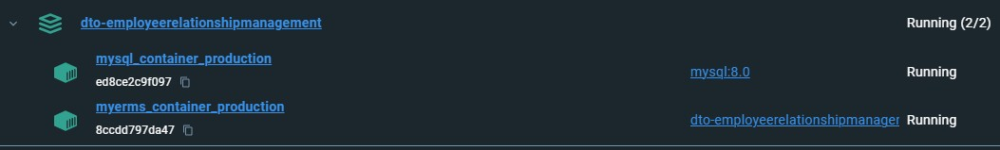

# Employee relationship management
- [Introduction](#introduction)
- [Features](#features)
- [Setup MySQL](#setup-mysql)
- [How to run](#how-to-run)
- [Running App container and MySQL container together on same network](#running-app-container-and-mysql-container-together-on-same-network)
## Introduction
- This project demonstrates how to manage employee relationships using a Spring Boot REST API. 
- It showcases CRUD operations and relational data handling between employees and their associated entities.
## Features
- RESTful API endpoints for managing employees and their relationships.
- Demonstrates one-to-one, one-to-many, and many-to-many relationships.
- Uses JPA and Hibernate for relational data mapping.
- Lightweight and easy-to-understand implementation.

## Setup MySQL
- The Employee entity uses JPA annotations such as `@Entity`, `@Table`, and `@GeneratedValue` and persists data in the database.
- Create a [docker-compose](MySQLsetup/docker-compose.yml) file
  - Add database creation as well in docker-compose file: `MYSQL_DATABASE: employee_management`
- run docker compose: `docker-compose up -d`
- Verify MySQL Docker container is running: `docker ps`
- **Configure** `application.properties` or `application.yml`:
- Add your MySQL connection details in the [application.properties](src/main/resources/application.properties) file:
```java
spring.datasource.url=jdbc:mysql://localhost:3306/employee_management
spring.datasource.username=root
spring.datasource.password=rootpassword
spring.jpa.hibernate.ddl-auto=update
spring.jpa.show-sql=true
spring.jpa.properties.hibernate.format_sql=true
```
- Start the Spring Boot application, and it will automatically create the `EMPLOYEE` table in the database (based on the Employee entity).

## How to run
- Build 
```bash
mvn clean install
```
- Run
```bash
mvn spring-boot:run
```
- API
- Get all employees
  - request "GET" `localhost:9999/employee/all`
  - response array of JSON object containing list of all employees
- Get specific employee using "Path variable"
  - request "GET" `localhost:9999/employee/find/2`
  - response details of Employee with id as 2
  - If "id" doesnot exists, "404 Not Found" is shown as response 
- Save employee
  - request "POST" `localhost:9999/employee/save`
  - with request body as JSON payload
    ```
    {
      "ename" : "Sachin",
      "eage" : 50,
      "eaddress" : "IND"
    }
    ```
  - response record created in database and response status as "201 created"
- Deleting the record
  - request "DELETE" `localhost:9999/employee/delete/10`
  - If "id" exists, response status as "200 OK"
  - If "id" doesnot exists, response status as "500 Internal Server Error"
- Updating the record
  - request "PUT" `localhost:9999/employee/update/10`
  - with request body as JSON payload
    ```
    {
      "eid" : 10,
      "ename" : "Tendulkar",
      "eage" : 50,
      "eaddress" : "IND"
    }
    ```
  - response record created in database and response status as "200 OK"
  - If "id" doesnot exists, "404 Not Found" is shown as response 

## Running App container and MySQL container together on same network
- [Docker commands](https://github.com/sbhrwl/system_design/blob/main/docs/deployment/containerisation/Docker/commands/README.md)
* **Create a Dockerfile** in your project root:
  ```dockerfile
  FROM openjdk:17-jdk-slim
  COPY target/*.jar app.jar
  ENTRYPOINT ["java", "-jar", "/app.jar"]
  ```
* Create [docker-compose.yml](docker-compose.yml) in the same folder:
* Build your Spring Boot app **JAR**
```
./mvnw clean package
```
* Run the containers:
```
docker-compose up --build
```
* Repeat above steps for testing APIs, remember to replace port with `8080`
* When you use a single docker-compose.yml file, 
  * Docker Compose automatically `creates a default network` and connects all services (your spring-app and mysql_container) to it.
```
docker network ls           # shows networks
docker network inspect <network_name>  # shows containers in the network
```


* For **deployment to Kubernetes**, [refer](https://github.com/sbhrwl/system_design/blob/main/docs/deployment/DevOpswithk8s/e2e/README.md)
