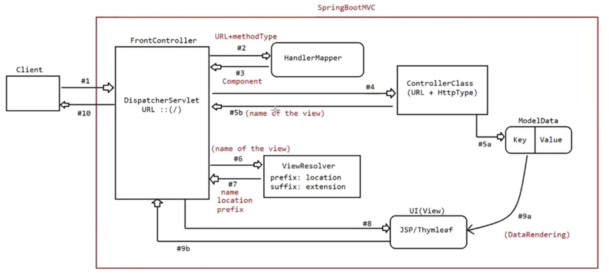

# Spring MVC

- This flow demonstrates how **Spring MVC separates concerns**: 
  - Controller handles logic
  - Model carries data
  - View renders the output
- The image illustrates the **Spring Boot MVC (Model-View-Controller)** request handling lifecycle using the **DispatcherServlet** as the front controller. 
- **Client request (#1):** The client sends a request to the application.
- **DispatcherServlet (#2):** It intercepts the request and consults the `HandlerMapper` to map the URL and HTTP method to a controller method.
- **Handler mapping (#3-#4):** Based on the mapping, the correct controller method is invoked.
- **Controller execution (#5a):** The controller processes the request and returns a model (data) and view name.
- **View name resolution (#5b-#6):** The `ViewResolver` appends a prefix and suffix to locate the actual view (e.g., `JSP` or `Thymeleaf` template).
- **Rendering view (#7-#9a):** The view is rendered using the model data.
- **Response to client (#9b-#10):** The final UI is returned to the client as a response.
## Projects
- [Spring MongoDB MVC](SpringMongoMVC/README.md)
- [MVC-01](MVC-01/README.md)
- [MVC-02](MVC-02/README.md)
- [MVC-03](MVC-03/README.md)
- [Sending data from controller to UI](SendingDataFromControllerToUI/README.md)
- [Sending data from UI to controller](SendingDataFromUIToController/README.md)
- [Two way binding object app](TwoWayBindingObjectApp/README.md)
- [Library management app](LibraryManagementApp/README.md)
- [Library management app continues](LibraryManagementAppContinues/README.md)
