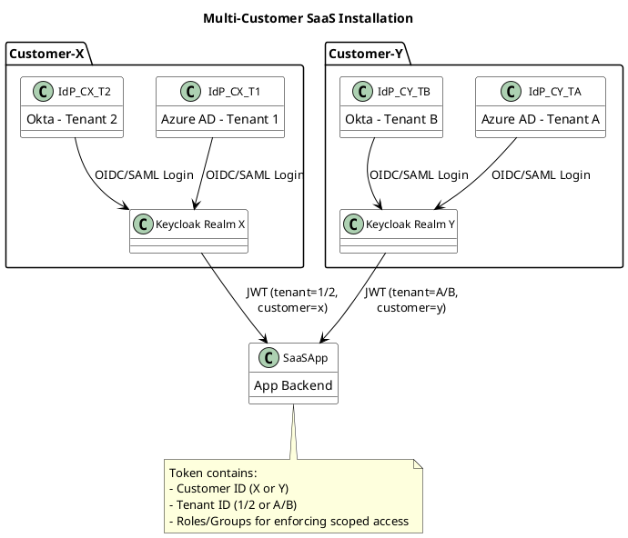
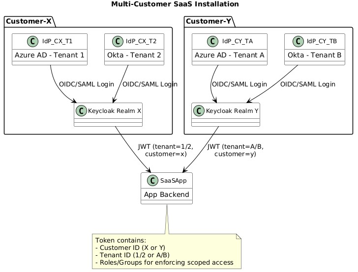

# Keycloak setup
* [Keycloak Documentation](https://www.keycloak.org/documentation)
* [`docker-compose.yaml`](docker-compose.yaml)
* Start Keycloak
```bash
docker-compose up -d
```
* Access Keycloak
  * URL: [http://localhost:8080](http://localhost:8080)
  * Username: `admin`
  * Password: `admin`
* Stop Services
```bash
docker-compose down
```

- [Realm](#realm)
- [SaaS](#saas)
- [Simulating multi tenancy in one realm](#simulating-multi-tenancy-in-one-realm)
- [Adding multiple IdP under arealm](#adding-multiple-idp-under-arealm)
  - [Keycloak behavior](#keycloak-behavior)
# Realm
- **One realm = one tenant**
  - Best practice for strong isolation
  - Users, clients, and roles are scoped to that realm.
  - There is **no strict multi-tenancy isolation** within a realm.
## SaaS
* **Create one realm per customer** (e.g., `customer-a-realm`, `customer-b-realm`)
* Inside each realm:
  * Use **user groups or attributes** to represent customer’s tenants (e.g., `tenant1`, `tenant2`)
  * Assign users to their respective tenant group
* In your app:
  * Decode the token
  * Enforce tenant-based data access using the group or custom claim
## Simulating multi tenancy in one realm
* Prefixing user attributes, roles, or client names by tenant ID
* Using **custom claims** and **client scopes** to enforce tenant-specific access
* Writing **custom authorization logic** or **policies** (e.g., in your app or Keycloak)


## Adding multiple IdP under arealm
- In a single realm in Keycloak, you **can absolutely add multiple Identity Providers (IdPs)** .
  * Users can choose **which IdP to log in with**, e.g., Tenant A via Azure AD, Tenant B via another OIDC.
  * Useful when your **customers (or tenants) have their own enterprise IdPs** but share a common realm in your SaaS.
### Keycloak behavior
* Each IdP is configured with a unique **alias**.
* On the login screen, users see multiple **social/login buttons**, one for each IdP.
* You can control access, user creation, and role mapping **per IdP** using mappers and authentication flows.


###
- A cloud-first distribution strategy has been a design paradigm when developing the solution GridFlex Control. 
- Accordingly, on-premise deployments are supported alternatively.
- Scaling limits of large multi-tenant instances of GridFlex Control will depend on many factors, including
  - the number of tenants and active users,
  - the number of flexibilities to be managed per tenant and overall, as well as
  - the frequence and magnitude of control actions and flex integration/onboarding activities.

- Horizontal scalability to accommodate for arbitrarily increasing load in `multi-tenant` environments is currently **not available** for the solution deployment (ConfigurationManager + docker) as it is described and proposed in this document.
  - According to licensing terms,
    - the current commercially binding upper threshold for system size is set at `100.000` flexibilities and `100` tenants, respectively.
    - is given for a significant majority of the solution components, but currently not for the whole solution.
- A K8s deployment for the GFC applications (node 2) will be made available as soon as KISTERS ConfigurationManager supports K8s as deployment mode, which is currently not the case. 
