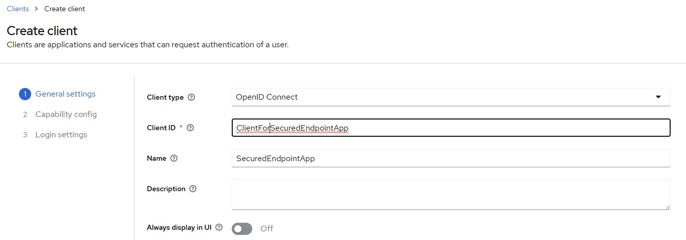
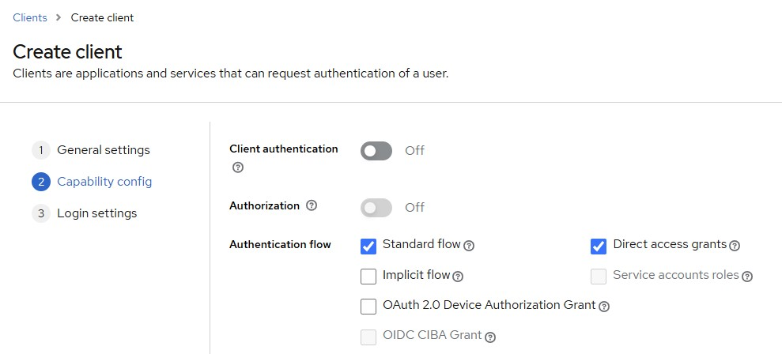
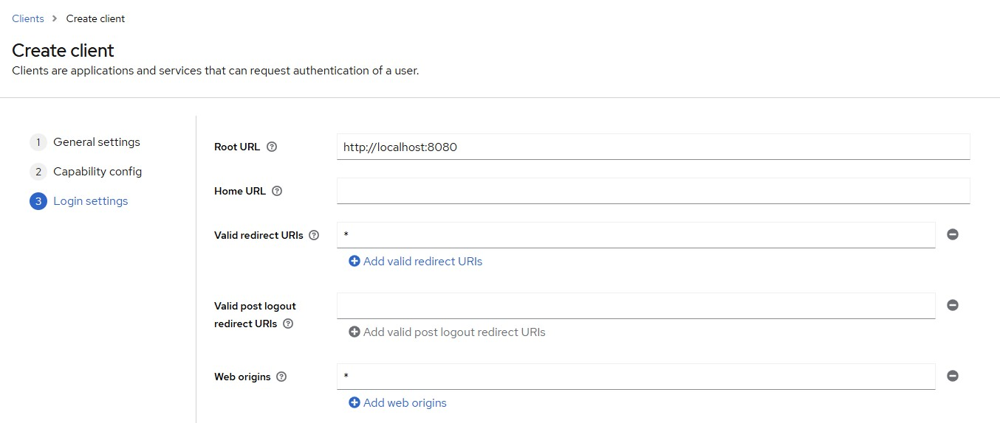
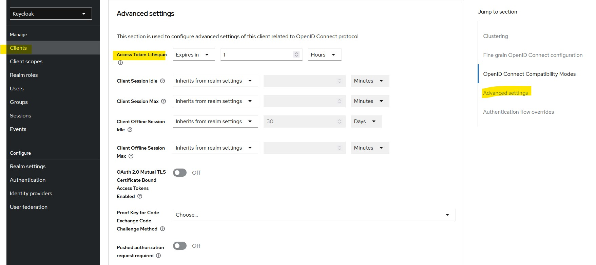

# RBAC
- [Create a user](#create-a-user)
- [Create a role](#create-a-role)
- [Assign role to user](#assign-role-to-user)
- [Create a new client for your app in keycloak](#create-a-new-client-for-your-app-in-keycloak)
  - [Why this is needed](#why-this-is-needed)
  - [Token expiry](#token-expiry)
## Create a user
- In the Keycloak admin console, go to `Users` (left sidebar).
- Click “Add user”.
  - Username: `endpointaccessuser` (or any name you prefer)
  - Leave everything else as default.
  - Click Save.
- Set a password for the user
  - After creating the user, go to the “Credentials” tab.
  - Set a password (e.g., `password123`).
    - **Temporary**: set to `Off` (so the user doesn’t need to change it).
  - Click Set Password.
## Create a role
- Create a role in Keycloak and assign it to your user
  - Open your Keycloak [admin console](http://localhost:8080).
  - Go to the "master" realm.
  - In the left menu, click "Roles".
  - Click "Add Role".
    - Role name: `endpointaccessrole`
    - Click Save

## Assign role to user
- Go to Users, and select your test user (the one you're logging in with).
- Go to the "Role Mappings" tab.
- Under "Available Roles", select the user role and click `Add selected`.

## Create a new client for your app in keycloak
- In **Keycloak Admin Console**, go to your realm (e.g. `Customer X-realm`).
- Click **Clients** → **Create client**.
- Fill in the details:
  * **Client ID**: `ClientForSecuredEndpointApp`
  * **Client type**: `Public`

- Click **Next**, then configure:
  * **Root URL**: `http://localhost:8081` (or your app’s base URL)
  * **Valid redirect URIs**: `*` (for now, or `http://localhost:8080/*`)
  * **Web Origins**: `*`
  * Leave other defaults as-is.
  * Click **Save**.

### Why this is needed
- You need this client so that:
  * Keycloak knows your app exists and can issue tokens for it.
  * Postman can request a token using `client_id=ClientForSecuredEndpointApp`.
### Token expiry

