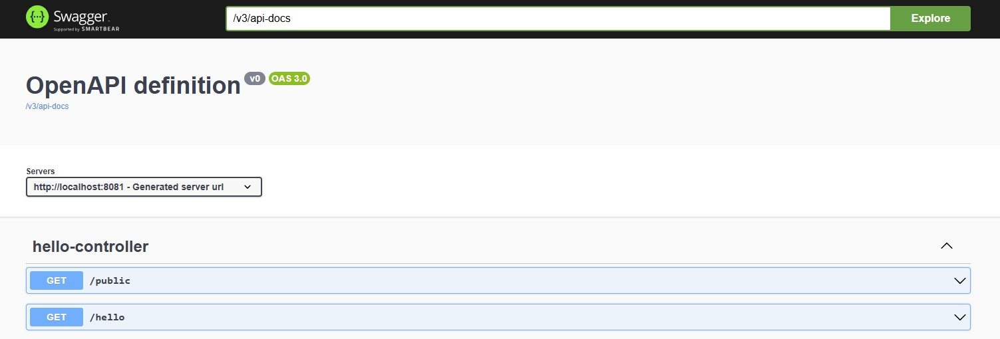

# Swagger UI
- [What is Swagger UI](#what-is-swagger-ui)
- [Why is it useful](#why-is-it-useful)
## What is Swagger UI
**Swagger UI** is a web-based interface that:
* **Displays your REST APIs** in an interactive way
* **Lets developers test endpoints** directly from the browser
* **Generates API documentation automatically** from annotations in your Spring Boot code (like `@GetMapping`, `@PostMapping`, etc.)

## Why is it useful
* Makes it easy to **understand and test** your API without writing curl or Postman requests
* Helps teams or external users see what endpoints are available and how to use them
* Ideal for **internal API debugging** or **developer documentation**
* Once it's set up and secured, only **authenticated users** will be able to view and test your APIs via Swagger UI.
## Add dependency
```
<!-- Swagger Core -->
<dependency>
    <groupId>org.springdoc</groupId>
    <artifactId>springdoc-openapi-starter-webmvc-ui</artifactId>
    <version>2.2.0</version>
</dependency>
```
## Update Filter chain
* Swagger UI and API docs are open to everyone.
* Your API endpoints (except `/public`) require a valid JWT token.
* Your app expects JWT tokens for auth because of `oauth2ResourceServer`.
- `configSecurityConfig.java`
```java
@Bean
public SecurityFilterChain securityFilterChain(HttpSecurity http) throws Exception {
    http
        .authorizeHttpRequests(auth -> auth
            .requestMatchers(
                "/public",
                "/swagger-ui/**",
                "/v3/api-docs/**",
                "/swagger-ui.html"
            ).permitAll()
            .anyRequest().authenticated()
        )
        .oauth2ResourceServer(oauth2 -> oauth2.jwt());

    return http.build();
}
```
### What it does step by step:
1. **`@Bean` and method signature**
   Declares a Spring-managed bean of type `SecurityFilterChain`. Spring Security uses this to know how to secure your HTTP endpoints.
2. **`http.authorizeHttpRequests(...)`**
   Starts configuring which HTTP requests are allowed or require authentication.
3. **`requestMatchers(...)`**
   Defines the URL patterns that this rule applies to.
   Here we say:
   * `/public` — your public endpoint (example)
   * `/swagger-ui/**` — all URLs under Swagger UI (like CSS, JS, etc.)
   * `/v3/api-docs/**` — OpenAPI JSON docs used by Swagger
   * `/swagger-ui.html` — main Swagger UI page
     These are set to be accessible by anyone (no authentication needed).
4. **`.permitAll()`**
   Means the URLs matched above are accessible **without logging in**.
5. **`.anyRequest().authenticated()`**
   Means *all other* URLs require the user to be authenticated (logged in).
6. **`.oauth2ResourceServer(oauth2 -> oauth2.jwt())`**
   Enables JWT-based OAuth2 resource server support — your app will expect JWT tokens on secured endpoints.
7. **`return http.build()`**
   Builds and returns the security filter chain with these settings.

## Access UI
- Start your Spring Boot app and open this URL in your browser: `http://localhost:8081/swagger-ui.html` OR `http://localhost:8081/swagger-ui/index.html`
- Swagger UI page listing your REST API endpoints.
