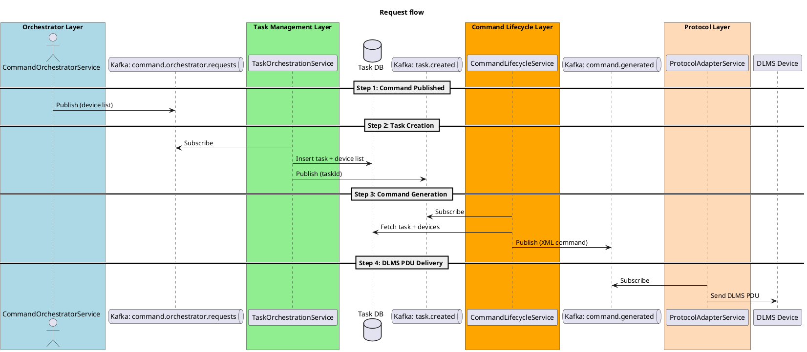
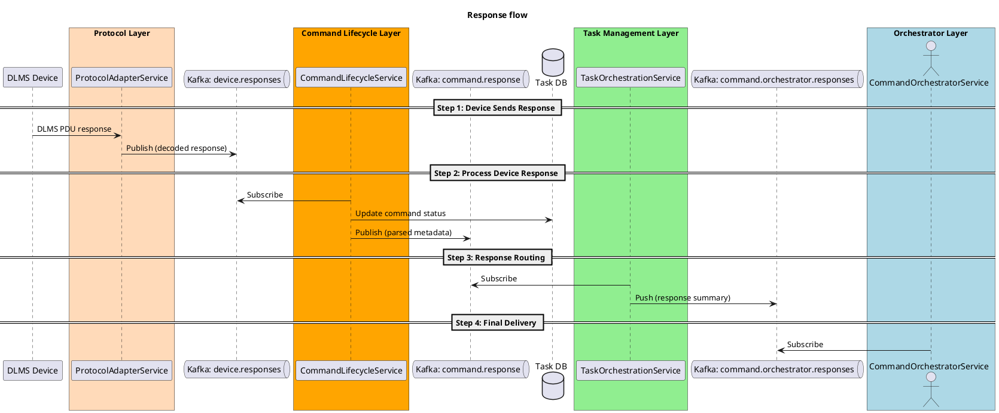

# Goals of transition
* Motivation for shift to microservices
  * Better scalability?
  * Independent deployments?
  * Fault isolation?
  * Tech stack modernization?
  * Integration with cloud-native platforms?
## Communication between these microservices
* **Event-driven** (e.g., using Pub/Sub to trigger each stage asynchronously), or
* **Request-response** (e.g., one microservice calling the next via REST or gRPC)?
## Approach for desiging microservices
* Services to be bounded strictly by **function** (e.g., `parsing, generating, protocol conversion`)?
  **Pros:**
  * High cohesion and single responsibility.
  * Easier to scale individual pieces (e.g., only scale the Gateway if protocol load is high).
  * Teams can own narrow technical areas.
  **Cons:**
  * Requires more coordination between services.
  * More inter-service communication (potential latency/debug complexity).
  **Best When:**
  * You expect uneven loads across stages.
  * You have clear technical boundaries and DevOps maturity.
* Services to be composed around **use-cases** (e.g., “`Command Lifecycle Service`” handling multiple stages)?
  **Pros:**
  * Fewer services, more end-to-end ownership.
  * Good for early-stage systems or if your team is small.
  * Less orchestration/communication overhead.
  **Cons:**
  * Can grow into a monolith if not managed well.
  * Harder to isolate performance bottlenecks.
  **Best When:**
  * Your use cases are strongly coupled.
  * Simpler ops and release cycles are a priority.
* Best practices
  * Start with **coarser-grained services** and break them down as you scale.
  * Use **domain boundaries** (bounded contexts in DDD) to guide decomposition.
  * Observe runtime behavior before splitting (e.g., if `Command Generator` spikes under load, consider isolating XML creation).
  * Services that interact with **infrastructure or protocols** (e.g., Protocol Gateway) are often better as independent functions.
## Architecture
### Request

### Response

## Services
| **Service Name**               | **Role / Responsibility**                                                               |
| ------------------------------ | --------------------------------------------------------------------------------------- |
| **CommandOrchestratorService** | Accepts commands from upstream apps; sends and receives status/responses                |
| **TaskOrchestrationService**   | Parses incoming requests; creates and manages tasks with list of devices                |
| **CommandLifecycleService**    | Generates device-specific commands; handles device responses and updates task status    |
| **ProtocolAdapterService**     | Converts commands from XML to DLMS PDU and vice versa; interfaces directly with devices |
| **UpstreamIntegrationService** | Pushes parsed and formatted responses back to orchestrator or external systems          |

